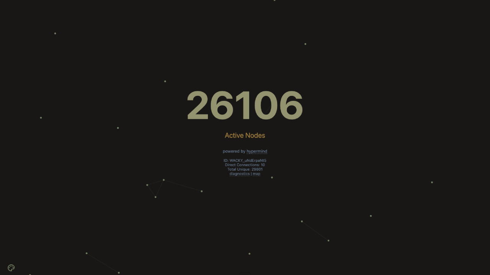

# Current themes

### Hypermind (Default)



### Hypermind Classic


### Tokyo Night


### Nord Dark


### Solarized Light


### Volcano


# Contributing custom themes

1. Fork `main` and clone locally to your device.
2. Create a copy of `hypermind.css` (or any other existing theme file).
   Rename the file `new-theme.css` replacing "new-theme" with the actual name of your theme.
   Filename may not include capitals or spaces (use dashes `-`).
   Only add `dark` or `light` to the filename if the theme you are creating is based on a popular theme (solarized, nord, etc) that has dark and light versions. If a theme does not have two versions, or if a theme is completely made up by you, do not add `dark` or `light`.
3. Edit the `const themes` block in [`app.js`](public/app.js) with the filename of your new theme so that when you press the theme cycle button in the bottom left corner of the UI, your new theme will appear as one of the options.
   ```js
    const themes = [
        'hypermind.css',
        'hypermind-classic.css',
        'tokyo-night.css',
        'nord-dark.css',
        'solarized-light.css',
        'volcano.css',
        'new-theme.css' /* always add to the end of the list
    ];
   ```
4. Change the colors as you desire. Reference [`index.html`](public/index.html) and [`style.css`](public/style.css) as needed.
5. Test changes by running `npm install` then `npm start` in a terminal.
6. Once you have finished creating your theme, edit [`THEMES.md`](THEMES.md) to include the name of your theme and a fullscreen screenshot in 16:9 aspect ratio at the bottom of the list. Ensure to match existing formatting.
7. Create a pull request titled `theme: add *name of theme*`.
   
#### Thank you for contributing to Hypermind!
